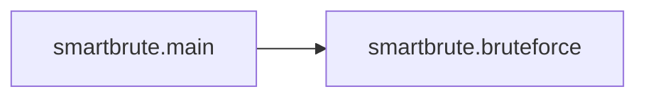
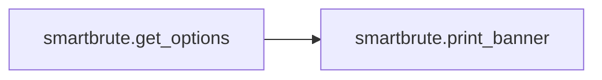

# Key Objects

[_Documentation generated by Documatic_](https://www.documatic.com)

<!---Documatic-section-smartbrute.print_banner-start--->
## smartbrute.print_banner

<!---Documatic-section-print_banner-start--->
<!---Documatic-block-smartbrute.print_banner-start--->
<details>
	<summary><code>smartbrute.print_banner</code> code snippet</summary>

```python
def print_banner():
    print('')
```
</details>
<!---Documatic-block-smartbrute.print_banner-end--->
<!---Documatic-section-print_banner-end--->

# #
<!---Documatic-section-smartbrute.print_banner-end--->

<!---Documatic-section-smartbrute.main-start--->
## smartbrute.main

<!---Documatic-section-main-start--->


### Object Calls

* smartbrute.bruteforce

<!---Documatic-block-smartbrute.main-start--->
<details>
	<summary><code>smartbrute.main</code> code snippet</summary>

```python
def main(options, logger, console, neo4j):
    secret = None
    if options.bf_password is not None or options.bf_passwords_file is not None:
        secret = 'password'
        logger.info('Starting bruteforce attack on passwords')
    elif options.bf_hash is not None or options.bf_hashes_file is not None:
        if options.bruteforced_protocol == 'ntlm':
            secret = 'NT hash'
            logger.info('Starting bruteforce attack on NT hashes')
        elif options.bruteforced_protocol == 'kerberos':
            secret = 'RC4 key'
            logger.info('Starting bruteforce attack on RC4 keys')
    elif options.user_as_password:
        secret = 'password'
    table = Table(show_header=True, header_style='bold blue', border_style='grey35', caption_style='', caption_justify='left', box=box.SQUARE)
    with Live(Columns((table,), expand=True), console=console, refresh_per_second=10, vertical_overflow='ellipsis'):
        table.add_column('domain')
        table.add_column('user')
        if options.running_mode == 'smart':
            if options.enum_policy:
                table.add_column('granular lockout threshold')
        if secret is not None:
            table.add_column(secret)
            table.add_column('details')
        bf = bruteforce(options, table, neo4j)
        if options.running_mode == 'brute':
            bf.bruteforce_attack()
        elif options.running_mode == 'smart':
            bf.smart_attack()
        table.caption = None
```
</details>
<!---Documatic-block-smartbrute.main-end--->
<!---Documatic-section-main-end--->

# #
<!---Documatic-section-smartbrute.main-end--->

<!---Documatic-section-smartbrute.get_options-start--->
## smartbrute.get_options

<!---Documatic-section-get_options-start--->


### Object Calls

* smartbrute.print_banner

<!---Documatic-block-smartbrute.get_options-start--->
<details>
	<summary><code>smartbrute.get_options</code> code snippet</summary>

```python
def get_options():
    print_banner()
    description = 'The smart password spraying and bruteforcing tool for Active Directory Domain Services.'
    parser = argparse.ArgumentParser(description=description)
    parser.add_argument('-v', '--verbose', dest='verbosity', action='count', default=0, help='verbosity level (-v for verbose, -vv for debug)')
    parser.add_argument('-q', '--quiet', dest='quiet', action='store_true', default=False, help='show no information at all')
    neo4j_group = parser.add_argument_group('neo4j option')
    neo4j_group.add_argument('--set-as-owned', dest='set_as_owned', action='store_true', help='Set valid users as owned in neo4j')
    neo4j_group.add_argument('-nh', '--neo4j-host', dest='neo4j_host', action='store', default='127.0.0.1', help='neo4j database address (default: 127.0.0.1)')
    neo4j_group.add_argument('-nP', '--neo4j-port', dest='neo4j_port', action='store', default='7687', help='neo4j database port (default:7687)')
    neo4j_group.add_argument('-nu', '--neo4j-user', dest='neo4j_user', action='store', default='neo4j', help='neo4j username (default: neo4j)')
    neo4j_group.add_argument('-np', '--neo4j-password', dest='neo4j_password', action='store', default='neo4j', help='neo4j password (default: neo4j)')
    bruteforce_mode = argparse.ArgumentParser(add_help=False)
    bruteforce_mode.add_argument('--delay', dest='delay', action='store', type=float, default=0, help='number of seconds to wait before each attempt (default: 0)')
    bruteforce_mode.add_argument('--stop-on-success', dest='stop_on_success', action='store_true', help='Stop bruteforcing when a valid authentication goes through')
    bruteforce_mode.add_argument('--no-enumeration', dest='no_enumeration', action='store_true', help='Skip basic LDAP domain dump (used to identify privileged users when a first valid auth is found)')
    bruteforce_mode.add_argument('--line-per-line', dest='line_per_line', action='store_true', default=False, help='given a users file and a passwords/hashes file, do not every each password/hash for every user (user1:password1, user2:password2, ...)')
    bruteforced_creds = bruteforce_mode.add_argument_group('credentials to test')
    bruteforced_users = bruteforced_creds.add_mutually_exclusive_group(required=True)
    bruteforced_users.add_argument('-bu', '--bf-user', dest='bf_user', action='store', help='username to test')
    bruteforced_users.add_argument('-bU', '--bf-users-file', dest='bf_users_file', action='store', help='usernames file to test')
    bruteforced_secrets = bruteforced_creds.add_mutually_exclusive_group(required=True)
    bruteforced_secrets.add_argument('--user-as-password', dest='user_as_password', action='store_true', default=False, help='try the username as password')
    bruteforced_secrets.add_argument('-bp', '--bf-password', dest='bf_password', action='store', help='password to test')
    bruteforced_secrets.add_argument('-bP', '--bf-passwords-file', dest='bf_passwords_file', action='store', help='passwords file to test')
    bruteforced_secrets.add_argument('-bh', '--bf-hash', dest='bf_hash', action='store', help='NT hash (or RC4 Kerberos key) to test')
    bruteforced_secrets.add_argument('-bH', '--bf-hashes-file', dest='bf_hashes_file', action='store', help='NT hashes (or RC4 Kerberos keys) file to test')
    bruteforce_mode_ntlm_mode = argparse.ArgumentParser(add_help=False)
    bruteforce_mode_ntlm_mode.add_argument('--dc-ip', dest='dc_ip', action='store', help='domain controller to authenticate to (when using -p/--application-protocol=smb, it can be set to something else than a DC)')
    bruteforce_mode_ntlm_mode.add_argument('-d', '--domain', dest='domain', action='store', help='domain to authenticate to')
    bruteforce_mode_ntlm_mode.add_argument('-p', '--application-protocol', choices=['ldap', 'smb'], dest='application_protocol', action='store', help='application layer protocol with which NTLM authentication has to be tried (default: smb)', default='smb')
    bruteforce_mode_kerberos_mode = argparse.ArgumentParser(add_help=False)
    bruteforce_mode_kerberos_mode.add_argument('--kdc-ip', dest='kdc_ip', action='store', help='key distribution center to obtain tickets from')
    bruteforce_mode_kerberos_mode.add_argument('-d', '--domain', dest='domain', action='store', required=True, help='domain to authenticate to')
    bruteforce_mode_kerberos_mode.add_argument('-p', '--transport-protocol', dest='transport_protocol', choices=['udp', 'tcp'], default='udp', action='store', help='transport protocol to use (default: udp)')
    bruteforce_mode_kerberos_mode.add_argument('-e', '--etype', dest='etype', action='store', choices=['rc4', 'aes128', 'aes256'], default='rc4', help='etype to use (default: rc4)')
    bruteforce_mode_protocols_subparser = bruteforce_mode.add_subparsers(help='this tells what authentication protocol smartbrute has to use when bruteforcing. When choosing kerberos, smartbrute will operate a pre-authentication bruteforce', dest='bruteforced_protocol')
    bruteforce_mode_ntlm_parser = bruteforce_mode_protocols_subparser.add_parser('ntlm', parents=[bruteforce_mode_ntlm_mode], help='attack through NTLM')
    bruteforce_mode_kerberos_parser = bruteforce_mode_protocols_subparser.add_parser('kerberos', parents=[bruteforce_mode_kerberos_mode], help='attack through Kerberos')
    smart_mode = argparse.ArgumentParser(add_help=False)
    smart_mode.add_argument('-t', '--lockout-threshold', dest='lockout_threshold', action='store', type=int, default=3, required=False, help='number of attempts to leave the user (0 could lockout accounts) (default: 3)')
    smart_mode.add_argument('--delay', dest='delay', action='store', type=float, default=0, help='number of seconds to wait before each attempt (default: 0)')
    smartbruteforced_action = smart_mode.add_mutually_exclusive_group(required=True)
    smartbruteforced_action.add_argument('--users', dest='enum_users', action='store_true', default=False, help='only show users list')
    smartbruteforced_action.add_argument('--policy', dest='enum_policy', action='store_true', default=False, help='only show accounts and passwords policy')
    smartbruteforced_action.add_argument('--user-as-password', dest='user_as_password', action='store_true', default=False, help='try the username as password')
    smartbruteforced_action.add_argument('-bp', '--bf-password', dest='bf_password', action='store', help='password to test')
    smartbruteforced_action.add_argument('-bP', '--bf-passwords-file', dest='bf_passwords_file', action='store', help='passwords file to test')
    smartbruteforced_action.add_argument('-bh', '--bf-hash', dest='bf_hash', action='store', help='NT hash (or RC4 Kerberos key) to test')
    smartbruteforced_action.add_argument('-bH', '--bf-hashes-file', dest='bf_hashes_file', action='store', help='NT hashes (or RC4 Kerberos keys) file to test')
    smart_mode_ntlm_mode = argparse.ArgumentParser(add_help=False)
    smart_mode_ntlm_mode.add_argument('--dc-ip', dest='dc_ip', action='store', help='domain controller to authenticate to')
    smart_mode_ntlm_mode.add_argument('-p', '--application-protocol', choices=['ldap', 'smb'], dest='application_protocol', action='store', help='application layer protocol with which NTLM authentication has to be tried (default: smb)', default='smb')
    smart_mode_kerberos_mode = argparse.ArgumentParser(add_help=False)
    smart_mode_kerberos_mode.add_argument('--kdc-ip', dest='kdc_ip', action='store', help='key distribution center to obtain tickets from')
    smart_mode_kerberos_mode.add_argument('-p', '--transport-protocol', dest='transport_protocol', choices=['udp', 'tcp'], default='udp', action='store', help='transport protocol to use (default: udp)')
    smart_mode_kerberos_mode.add_argument('-e', '--etype', dest='etype', action='store', choices=['rc4', 'aes128', 'aes256'], default='rc4', help='etype to use (default: rc4)')
    ntlm_auth = argparse.ArgumentParser(add_help=False)
    ntlm_auth.add_argument('--dc-ip', dest='auth_dc_ip', metavar='DC_IP', action='store', help='domain controller to authenticate to')
    ntlm_auth.add_argument('-d', '--domain', dest='auth_domain', metavar='DOMAIN', action='store', required=True, help='domain to authenticate to')
    ntlm_auth.add_argument('-u', '--auth-user', dest='auth_user', metavar='USER', action='store', required=True, help='user to authenticate with')
    ntlm_secrets = ntlm_auth.add_mutually_exclusive_group(required=True)
    ntlm_secrets.add_argument('-p', '--auth-password', dest='auth_password', metavar='PASSWORD', action='store', help='password to authenticate with')
    ntlm_secrets.add_argument('-H', '--auth-hashes', dest='auth_hashes', action='store', metavar='[LMHASH:]NTHASH', help='hashes to authenticate with')
    ntlm_mode_protocols_subparser = ntlm_auth.add_subparsers(help='this tells what authentication protocol smartbrute has to use when bruteforcing. When choosing kerberos, smartbrute will operate a pre-authentication bruteforce', dest='bruteforced_protocol')
    smart_mode_ntlm_parser = ntlm_mode_protocols_subparser.add_parser('ntlm', parents=[smart_mode_ntlm_mode], help='attack through NTLM')
    smart_mode_ntlm_parser = ntlm_mode_protocols_subparser.add_parser('kerberos', parents=[smart_mode_kerberos_mode], help='attack through Kerberos')
    kerberos_auth = argparse.ArgumentParser(add_help=False)
    kerberos_auth.add_argument('--kdc-ip', dest='auth_kdc_ip', metavar='KDC_IP', action='store', help='key distribution center to obtain tickets from')
    kerberos_auth.add_argument('--use-ldaps', dest='auth_use_ldaps', action='store_true', help='Use LDAPS instead of LDAP to query domain information (default: False)')
    kerberos_secrets = kerberos_auth.add_mutually_exclusive_group()
    kerberos_secrets.add_argument('-t', '--ccache-ticket', dest='auth_ccache_ticket', action='store', metavar='/path/to/ticket.ccache', help='path to a .ccache file (kerberos ticket)')
    kerberos_credentials = kerberos_secrets.add_argument_group('credentials to use')
    kerberos_credentials.add_argument('-d', '--domain', dest='auth_domain', metavar='DOMAIN', action='store', help='(FQDN) domain to authenticate to')
    kerberos_credentials.add_argument('-u', '--user', dest='auth_user', metavar='USER', action='store', help='user to authenticate with')
    kerberos_secret = kerberos_credentials.add_mutually_exclusive_group()
    kerberos_secret.add_argument('-p', '--password', dest='auth_password', metavar='PASSWORD', action='store', help='password to authenticate with')
    kerberos_secret.add_argument('-H', '--hash', dest='auth_rc4_key', metavar='RC4_KEY', action='store', help='RC4 kerberos key (i.e. NT hash) to authenticate with')
    kerberos_secret.add_argument('-k', '--key', dest='auth_aes_key', action='store', metavar='AES_KEY', help='AES128 or AES256 kerberos key to authenticate with (in hex)')
    kerberos_mode_protocols_subparser = kerberos_auth.add_subparsers(dest='bruteforced_protocol')
    smart_mode_kerberos_parser = kerberos_mode_protocols_subparser.add_parser('ntlm', parents=[smart_mode_ntlm_mode], help='attack through NTLM')
    smart_mode_kerberos_parser = kerberos_mode_protocols_subparser.add_parser('kerberos', parents=[smart_mode_kerberos_mode], help='attack through Kerberos')
    mode_subparsers = smart_mode.add_subparsers(help='this is a required argument and tells smartbrute which protocol to use when authenticating to gather information before bruteforcing (like users, policies, ...)', dest='auth_protocol')
    ntlm_parser = mode_subparsers.add_parser('ntlm', parents=[ntlm_auth], help='authenticate through NTLM to gather information')
    kerberos_parser = mode_subparsers.add_parser('kerberos', parents=[kerberos_auth], help='authenticate through Kerberos to gather information')
    subparsers = parser.add_subparsers(help='this is a required argument and tells smartbrute in which mode to run. smart mode will enumerate users and policies and avoid locking out accounts given valid domain credentials. brute mode is dumb and only bruteforces.', dest='running_mode')
    bruteforce_parser = subparsers.add_parser('brute', parents=[bruteforce_mode], help='bruteforce mode')
    smart_parser = subparsers.add_parser('smart', parents=[smart_mode], help='smart mode')
    options = parser.parse_args()
    if options.running_mode is None:
        print('error: please choose between smart and brute for running mode. This has to be supplied as a positional argument (i.e. smartbrute.py smart)')
        parser.print_help()
        exit(0)
    if options.running_mode == 'brute' and options.bruteforced_protocol is None:
        print('error: please choose between ntlm and kerberos for bruteforce mode. This has to be supplied as a positional argument (i.e. smartbrute.py brute [options] ntlm [options])')
        bruteforce_parser.print_help()
        exit(0)
    if options.running_mode == 'smart' and options.auth_protocol is None:
        print('error: please choose between ntlm and kerberos for authentication protocol when using the smart mode. This has to be supplied as a positional argument (i.e. smartbrute.py smart [options] ntlm [options])')
        smart_parser.print_help()
        exit(0)
    if options.running_mode == 'smart' and options.enum_users == False and (options.enum_policy == False) and (options.bruteforced_protocol is None):
        print('error: either set --users or --policy or choose a bruteforced protocol (ntlm or kerberos) as positional argument (i.e. smartbrute.py smart --users [options] ntlm [options], or smartbrute.py smart [options] ntlm [options] ntlm)')
        smart_parser.print_help()
        exit(0)
    if (options.running_mode == 'brute' and options.bruteforced_protocol == 'ntlm') and options.dc_ip is None and (options.domain is None):
        bruteforce_mode_ntlm_mode.error('one of the arguments -d/--domain --dc-ip is required')
    if (options.running_mode == 'brute' and options.line_per_line == True) and (options.bf_users_file is None or (options.bf_passwords_file is None and options.bf_hashes_file is None)):
        bruteforce_mode.error('with --line-per-line, argument -bU/--bf-users-file is required and one of the arguments -bP/--bf-passwords-file -bH/--bf-hashes-file is required')
    if options.running_mode == 'smart' and options.auth_protocol == 'kerberos' and (options.auth_ccache_ticket is None) and (options.auth_domain is None or options.auth_user is None or (options.auth_password is None and options.auth_aes_key is None and (options.auth_rc4_key is None))):
        print('error: either set -t/--ccache-ticket or (-d/--domain with -u/--user with (-p/--password or -H/--hash or -k/--aes-key))')
        kerberos_parser.print_help()
        exit(0)
    if options.running_mode == 'smart' and options.auth_protocol == 'kerberos' and (options.auth_domain is not None) and ('.' not in options.auth_domain):
        print('error: FQDN domain is needed')
        kerberos_parser.print_help()
        exit(0)
    if options.bruteforced_protocol == 'kerberos':
        if (options.bf_hash is not None or options.bf_hashes_file is not None) and options.etype != 'rc4':
            print("error: -e/--etype was set to aes128 or aes256 but a RC4 key (or set of) was supplied with -bh/-bH, this doesn't make sense. Resuming the bruteforce with RC4 etype.")
            kerberos_parser.print_help()
            exit(0)
    return options
```
</details>
<!---Documatic-block-smartbrute.get_options-end--->
<!---Documatic-section-get_options-end--->

# #
<!---Documatic-section-smartbrute.get_options-end--->

[_Documentation generated by Documatic_](https://www.documatic.com)